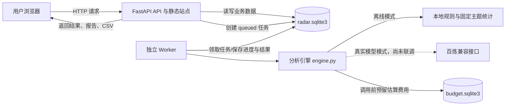
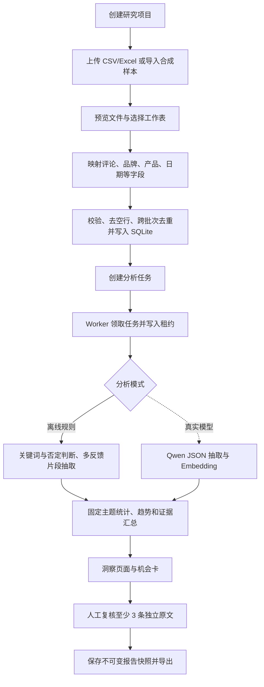

# Consumer Signal Radar 技术架构与开发说明

## 变更定位

- 文档用途：帮助第一次接触前后端开发的人理解 Consumer Signal Radar 的技术结构、数据流、关键代码、启动维护方法和当前能力边界。
- 对应版本：`production/` 本机正式版 v1.0，核对日期为 2026-09-08。
- 阅读顺序：先看第 1～4 节建立整体认识，再按第 5～12 节理解各模块；需要启动或排错时直接看第 13～16 节。
- 事实边界：本文依据当前代码和验收记录编写。离线流程已经本机验证；真实百炼模型、Docker 容器和公网部署尚未完成实际验证。

## 1. 先用一句话理解这个系统

Consumer Signal Radar 是一套本机运行的消费者评论分析系统：用户在网页上传 CSV 或 Excel 评论，后端保存数据并创建分析任务，独立 Worker 在后台处理评论，最终把零散原文整理成主题统计、机会卡、原文证据和可下载报告。

这里有四个最重要的技术角色：

| 角色 | 小白理解 | 当前实现 |
| --- | --- | --- |
| 前端 | 用户看见和点击的网页 | React + Vite |
| API 后端 | 接收网页请求、校验权限和管理数据的“柜台” | FastAPI |
| Worker | 在后台慢慢处理分析任务的“加工车间” | 独立 Python 进程 |
| 数据库 | 保存项目、评论、任务和报告的“档案柜” | SQLite |

系统默认只监听本机地址 `127.0.0.1:18522`。这表示同一台电脑可以访问，但它不是公网网站。

## 2. 系统架构图



这张图里最关键的设计是：网页请求和耗时分析分开。API 收到任务后先把任务放进数据库，Worker 再领取处理。这样分析几十或几千条评论时，网页服务不会一直卡在一个请求里。

## 3. 一条评论如何走完整个系统



“预览”和“正式导入”是两个步骤。预览只让用户确认列名和字段映射；正式导入才会写入数据库。这个设计能减少把产品列误当评论列的错误。

## 4. 项目目录树

下面只列出理解和运行项目需要关注的文件，省略依赖包、缓存和运行日志细节。

```text
production/
├─ frontend/                         网页前端
│  ├─ src/
│  │  ├─ App.jsx                    登录、导航、项目页和全局状态
│  │  ├─ DataPage.jsx               文件预览、字段映射和数据导入
│  │  ├─ AnalysisPage.jsx           创建、查看、取消和重试任务
│  │  ├─ InsightsPage.jsx           主题、趋势、机会卡和证据复核
│  │  ├─ ReportsPage.jsx            报告列表、阅读和下载
│  │  ├─ api.js                     统一调用 /api 接口
│  │  ├─ ui.jsx                     通用界面组件
│  │  └─ styles.css                 桌面与窄屏响应式样式
│  ├─ dist/                         已构建、由后端提供的前端文件
│  ├─ package.json                  前端依赖和构建命令
│  └─ vite.config.config.js                   开发服务器与 /api 代理
├─ backend/                          Python 后端
│  ├─ server.py                     API、登录、导入、报告和静态文件
│  ├─ worker.py                     后台任务领取、进度和故障恢复
│  ├─ engine.py                     抽取、聚类、统计、机会卡和评测
│  ├─ db.py                         SQLite 连接、表结构和公共方法
│  ├─ requirements.txt              Python 依赖
│  ├─ test_engine.py                分析与预算测试
│  ├─ test_server.py                API 业务链路测试
│  └─ test_runtime.py               启动和备份恢复测试
├─ data/demo_reviews.csv             40 条合成演示简介，仅用于演示
├─ runtime/
│  ├─ radar.sqlite3                 业务数据库
│  ├─ budget.sqlite3                模型费用预留账本
│  ├─ api.log                       API 日志
│  ├─ worker.log                    Worker 日志
│  └─ worker-heartbeat.json         Worker 心跳记录
├─ docs/                             项目文档
├─ .env                              本机私密配置，不应分享
├─ .env.example                      配置字段示例
├─ configure.py                      首次生成本机配置
├─ launch.py                         启动 API 和 Worker
├─ 启动正式版.cmd                    Windows 一键启动入口
├─ 本机配置.cmd                      Windows 配置入口
├─ maintenance.py                    业务数据库备份与隔离恢复
├─ Dockerfile                        容器镜像定义文件，尚未实测
└─ compose.yaml                      API、Worker 与数据卷定义，尚未实测
```

## 5. 前端是怎样工作的

### 5.1 使用的技术

- React：把页面拆成组件，并在数据变化时刷新界面。
- Vite：开发和生产构建工具。生产构建结果在 `frontend/dist/`。
- Recharts：绘制洞察图表。
- Lucide React：提供界面图标。
- React Markdown：显示已经保存的 Markdown 报告。

### 5.2 五个主要页面

| 页面 | 对应代码 | 主要职责 |
| --- | --- | --- |
| 项目 | `App.jsx` | 创建和选择一个研究项目 |
| 数据 | `DataPage.jsx` | 上传文件、选择工作表、映射字段、导入样本 |
| 分析 | `AnalysisPage.jsx` | 选择批次和模式，创建任务，查看进度、取消或重试 |
| 洞察 | `InsightsPage.jsx` | 展示主题统计、趋势、机会卡和原文证据，进行人工复核 |
| 报告 | `ReportsPage.jsx` | 查看历史报告并下载 Markdown |

`api.js` 是前端的统一“通信员”。所有接口都经过它发送；遇到未登录状态时，它会触发会话过期事件，让界面回到登录页。

### 5.3 开发模式和生产模式的区别

开发模式下，Vite 提供网页，并把 `/api` 请求转发到后端。生产模式下，Vite 先把网页构建到 `dist/`，FastAPI 再直接返回这些静态文件。当前一键启动走的是生产模式。

## 6. FastAPI 后端负责什么

`backend/server.py` 是业务入口，主要职责如下：

1. 启动时初始化数据库和管理员密码。
2. 校验登录会话和写请求来源。
3. 接收 CSV、XLSX 文件并生成预览。
4. 校验字段映射、数据规模和项目归属。
5. 创建异步分析任务，但不在网页请求里执行耗时分析。
6. 读取分析结果、修改机会卡复核状态。
7. 保存不可变报告快照，导出 Markdown 和 CSV。
8. 提供已经构建的 React 页面。

单次导入和单个任务最多处理 5000 条评论。CSV 支持 UTF-8 和 GB18030；Excel 支持选择工作表。上传大小、解压后大小、列数和行数都有边界校验，用来降低异常文件耗尽资源的风险。

## 7. API 接口速查

API 可以理解成网页和后端约定的“服务窗口”。以下接口均已在当前代码中实现。

| 方法与路径 | 用途 |
| --- | --- |
| `GET /api/health` | 检查当前服务是不是本项目 |
| `POST /api/auth/login` | 使用管理员密码登录 |
| `GET /api/auth/me` | 检查当前会话 |
| `POST /api/auth/logout` | 退出登录 |
| `GET /api/settings` | 读取模型是否配置、是否启用和最大行数；不返回密钥 |
| `GET /api/projects` | 查看项目列表 |
| `POST /api/projects` | 创建项目 |
| `POST /api/projects/{id}/imports/preview` | 上传并预览 CSV/XLSX |
| `POST /api/projects/{id}/imports` | 确认映射并导入数据 |
| `GET /api/projects/{id}/imports` | 查看导入批次 |
| `POST /api/projects/{id}/demo` | 导入合成演示数据 |
| `GET /api/projects/{id}/reviews` | 分页和搜索原始评论 |
| `POST /api/projects/{id}/jobs` | 创建离线或真实模型任务 |
| `GET /api/projects/{id}/jobs` | 查看项目任务 |
| `GET /api/jobs/{id}` | 查看任务状态和进度 |
| `POST /api/jobs/{id}/cancel` | 取消任务 |
| `POST /api/jobs/{id}/retry` | 续跑失败或取消的任务 |
| `GET /api/jobs/{id}/result` | 获取完整分析结果 |
| `PATCH /api/jobs/{id}/cards/{card_id}` | 编辑假设及标记人工复核 |
| `POST /api/jobs/{id}/reports` | 保存草稿或正式报告快照 |
| `GET /api/projects/{id}/reports` | 查看报告列表 |
| `GET /api/reports/{id}` | 读取报告快照 |
| `GET /api/reports/{id}/download` | 下载 Markdown 报告 |
| `GET /api/jobs/{id}/export.csv` | 导出结构化评论 |
| `GET /api/jobs/{id}/annotation.csv` | 下载最多 100 条标注模板 |
| `POST /api/jobs/{id}/evaluate` | 上传人工标注并计算 F1 |

接口的更具体字段约定以项目根目录的 `CONTRACT.md` 为准。

## 8. Worker 为什么要独立存在

Worker 在 `backend/worker.py` 中运行。它会循环查找状态为 `queued` 的任务，或者接管租约已经超时的 `running` 任务。

租约可以理解成任务上的“正在由我处理”便签。Worker 领取任务后定期续租并保存进度；如果进程异常退出，租约过期后另一个 Worker 可以接管。分析检查点会保存已经完成的抽取和向量结果，重试时可以继续处理，减少重复请求和重复费用。

任务状态包括：

| 状态 | 含义 |
| --- | --- |
| `queued` | 已排队，等待 Worker |
| `running` | 正在分析 |
| `succeeded` | 分析完成，可读取结果 |
| `failed` | 发生错误，可检查日志并重试 |
| `cancelled` | 用户取消，可在条件满足时续跑 |

`worker-heartbeat.json` 每隔一段时间记录进程编号和时间。一键启动不仅检查心跳是否新鲜，还检查该进程是否真实存在，避免旧心跳造成“看起来在运行”的误判。

## 9. SQLite 数据怎样保存

业务数据保存在 `runtime/radar.sqlite3`。主要数据表如下：

| 数据表 | 保存内容 |
| --- | --- |
| `meta` | 管理员密码哈希等系统信息 |
| `sessions` | 登录会话及过期时间 |
| `attempts` | 登录尝试，用于限制暴力猜密码 |
| `projects` | 研究项目 |
| `previews` | 文件预览和待确认字段映射 |
| `batches` | 正式导入的数据批次及数据类型声明 |
| `reviews` | 原始评论和标准字段 |
| `jobs` | 分析任务、进度、检查点、租约和结果 |
| `reports` | 保存时冻结的报告快照和 Markdown |

评论指纹用于同一项目内的跨批次去重。指纹考虑评论正文及品牌、产品、平台和日期，避免完全相同的记录被重复计为独立证据。

模型费用记录保存在独立的 `runtime/budget.sqlite3`。它有意与业务数据库分开，恢复旧业务数据时不会把已经发生的费用记录一起回滚。

## 10. 分析算法：目前真正做了什么

### 10.1 离线模式

离线模式不会访问互联网，也不会调用大模型。它的流程是：

1. 按标点把评论拆成反馈片段。
2. 使用关键词和简单否定判断识别主题。
3. 一条评论可以包含多个反馈，例如同时识别“刺激”和“吸收快”。
4. 抽取原文明示的场景、成分和诉求。
5. 按最严重反馈生成评论级主标签。
6. 规范化文本并去重后，统计固定主题和证据。

当前固定主题包括：刺激与耐受、叠涂搓泥、闷痘负担、保湿不足、黏腻与吸收、包装体验、价格门槛、功效预期、正向体验、待人工归类。

离线模式适合面试演示系统流程和证据机制，不代表具备大模型的语义理解水平。例如很隐晦的新表达可能会进入“待人工归类”。

### 10.2 主题热度、严重度和优先级

统计前先对规范化正文全局去重，防止重复上传人为放大证据。核心指标是：

- 提及量：去重后有多少条评论涉及该主题。
- 负面占比：该主题内负面或混合评论所占比例。
- 平均严重度：负面证据严重度的平均值，范围 0～3。
- 优先级：`100 × 主题提及量 / 去重样本总量 × 负面占比 × 平均严重度 / 3`。

这与最初设想的“热度 × 增长 × 严重程度 × 未满足程度”不同。当前代码没有独立、经过验证的“未满足程度”模型，因此不虚构这一因子。

### 10.3 增长和趋势的边界

只有日期有效，并且样本覆盖前后两个连续 7 天窗口时，系统才比较主题在两个窗口中的样本份额。没有足够日期时，增长值为缺失，不制造增长结论。

即使计算出增长，它也只表示“这批导入样本里的份额变化”，不代表全网声量或真实市场趋势。系统没有自动采集各平台完整数据，因此无法推断总体市场。

### 10.4 证据卡生成规则

一个主题至少要有 3 条规范化去重后的负面或混合原文，才生成机会卡。每张卡最多关联 5 条优先证据。人工勾选“已复核”时，后端会再次确认至少有 3 条独立证据。

机会卡区分四类内容：样本事实、待验证假设、验证建议和结论边界。它给产品经理一个调查方向，不把相关性写成产品或成分因果。

## 11. 真实模型接入设计与当前边界

真实模型模式的代码已经接入百炼兼容 OpenAI 风格接口，默认配置为：

- 抽取模型：`qwen3.5-plus`，关闭思考模式，要求返回 JSON。
- 向量模型：`text-embedding-v4`。
- 服务地址：`https://dashscope.aliyuncs.com/compatible-mode/v1`。

模型抽取每批最多 8 条评论，向量化每批最多 10 条。返回内容必须通过服务端校验：主题和标签必须在允许范围内；严重度必须为 0～3；证据摘录必须真的是原文子串；明示诉求必须能在原文找到；评论 ID、向量数量、顺序、维度和数值也必须合法。校验失败不会把可疑结果当成事实保存。

向量会使用归一化后的 KMeans 生成探索性聚类，随机种子固定为 42。探索聚类只帮助发现相近表达；正式趋势仍由固定主题驱动，避免每次聚类编号变化导致趋势口径漂移。

当前必须明确：API Key 尚未配置，`RADAR_PAID_ENABLED=false`，真实百炼请求没有实际成功记录。因此“代码已接入”不等于“真实模型效果已验证”。

## 12. 费用、安全和数据边界

### 12.1 预算控制

每次真实模型请求发出前，系统会按当前代码中的保守单价和请求大小估算费用，并写入独立预算账本。累计预留费用达到 `RADAR_BUDGET_CNY` 后，新请求会被阻止。当前上限是 20 元。

失败或结果不确定的请求不会自动退回本地预留额，目的是避免重试绕过累计上限。这个账本只是项目侧保护，不是服务商正式账单；模型价格变化后需要同步更新估算逻辑，并以服务商账单为准。

### 12.2 登录和请求安全

- 管理员密码至少 12 个字符，保存为 scrypt 哈希，不明文写入业务数据库。
- 登录会话使用随机令牌，Cookie 设置 `HttpOnly` 和 `SameSite=Strict`，默认 12 小时过期。
- 15 分钟内同一来源最多尝试登录 10 次。
- 写请求检查 `Origin` 和 `Sec-Fetch-Site`，降低跨站请求风险。
- `GET /api/settings` 只返回“是否已配置”和非敏感模型参数，不会返回 API Key；`POST /api/settings` 接收登录用户单向提交的配置，校验后原子写入本机 `.env`。
- `.env` 被排除在公开提交范围外；密钥不应出现在聊天、截图、报告或代码仓库中。
- CSV 导出会处理以 `= + - @` 等字符开头的单元格，降低电子表格公式注入风险。
- 静态文件服务检查目标路径，阻止用路径跳转读取项目外文件。

### 12.3 数据与合规边界

系统记录的是导入时由用户声明的数据类型，并不会自动验证数据授权、真实性或代表性。合成样本只能证明流程可运行，不能成为真实消费者结论。没有得到明确使用许可的数据，不应上传给第三方模型或用于公开展示。

## 13. 本机启动和开发方式

### 13.1 普通使用者启动

在 `production/` 目录双击 `启动正式版.cmd`。它会：

1. 检查并生成本机 `.env` 配置。
2. 确认 `frontend/dist/index.html` 已存在。
3. 启动 FastAPI 服务并访问 `/api/health` 验证身份。
4. 检查 Worker 是否真实存活，不在运行时启动新 Worker。
5. 打开 `http://127.0.0.1:18522`。

管理员密码保存在本机 `.env` 中。模型配置可在登录后的网页右上角“模型配置”中填写，也可双击 `本机配置.cmd`；不要把 `.env` 发给别人。

### 13.2 开发者重新构建前端

在 `frontend/` 中安装依赖并运行生产构建：

```powershell
npm.cmd install
npm.cmd run build
```

构建成功后应出现 `frontend/dist/index.html` 和带哈希名称的资源文件。修改 React 源码后必须重新构建，否则一键启动看到的仍可能是旧页面。

### 13.3 开发者安装后端依赖

项目 Python 依赖记录在 `backend/requirements.txt`。在新的虚拟环境中安装依赖后，再由 `launch.py` 启动服务。当前电脑已经具备运行环境；换电脑时需要重新准备。

## 14. 备份与恢复

业务数据库备份使用 `maintenance.py`。备份和恢复前，应先停止正在写入数据的 API 与 Worker，并保存原 `.env`。

备份到一个全新的目录：

```powershell
python maintenance.py backup --destination D:\RadarBackup\backup-20260908
```

从备份恢复到另一个全新的目录：

```powershell
python maintenance.py restore --source D:\RadarBackup\backup-20260908 --destination D:\RadarRestore\restore-20260908
```

程序会使用 SQLite 的备份接口复制数据库，并执行完整性检查。目标目录必须原本不存在，防止覆盖已有数据。备份清单为 `manifest.json`。

备份明确排除：

- `.env` 和所有密钥；
- `budget.sqlite3` 预算账本。

恢复程序也会拒绝包含预算账本的旧备份。这样恢复历史业务数据不会同时抹掉已经预留的模型费用记录。恢复目前是“恢复到隔离新目录”，不会自动替换正在使用的数据库；切换生产数据前需要另行核对目标路径和停机窗口。

## 15. 测试与已经验证的范围

当前后端共有 22 项自动测试，分为三组：

- `test_engine.py`：去重证据、多反馈抽取、日期边界、来源声明、断点续跑、伪造摘录拒绝、付费关闭、累计预算和空标签评测。
- `test_server.py`：导入到报告的完整业务链路、取消重试、租约恢复、断点续跑、前端静态资源、登录和跨项目边界、Excel 导入、CSV 安全及评论搜索。
- `test_runtime.py`：旧心跳进程识别、备份恢复排除预算账本、拒绝旧式预算备份、预算路径不随恢复目录变化。

根据本机验收记录，以下已经验证：前端生产构建、服务健康检查、API 与 Worker 启动、登录、创建项目、导入 40 条合成评论、离线分析、洞察证据复核、保存和下载报告、390×844 窄屏布局，以及隔离目录中的备份恢复。

以下尚未验证：真实百炼调用、800～1000 条获准真实中文评论、至少 100 条独立人工标注、关键字段 F1 ≥ 0.8、Docker 实际运行和公网部署。

## 16. 常见故障排查

### 16.1 双击启动后网页打不开

先确认地址是 `http://127.0.0.1:18522`。查看 `runtime/api.log`：

- 提示前端未构建：进入 `frontend/` 运行 `npm.cmd run build`。
- 提示密码不足 12 位：运行 `本机配置.cmd` 设置合规密码。
- 提示端口占用：确认 18522 上运行的是否是本项目；不要直接关闭来源不明的其他程序。
- 日志没有更新：重新运行启动脚本，并检查 Python 环境和依赖是否仍存在。

### 16.2 任务一直显示等待分析

查看 `runtime/worker.log` 和 `runtime/worker-heartbeat.json`。启动脚本会自动检查真实进程；如果 Worker 已退出，再次运行启动脚本应启动新进程。不要只看心跳文件时间判断 Worker 存活。

### 16.3 文件无法导入

依次检查：文件是否为 CSV/XLSX、是否超过大小限制、工作表是否选对、评论正文列是否已映射、是否超过 5000 行。重复数据可能被去重，因此“文件行数”和“实际新增数”不一定相同。

### 16.4 没有生成机会卡

这通常不是程序故障。每个主题需要至少 3 条独立的负面或混合原文。样本太少、内容重复、都为正面或未命中固定主题时，都可能没有机会卡。

### 16.5 趋势显示为空

趋势要求存在有效日期，且覆盖两个可比较的连续 7 天窗口。日期不足或格式无法解析时，系统会保留为空，避免编造增长。

### 16.6 真实模型按钮不能使用

需要同时满足：本机填写 API Key、服务地址为 HTTPS、模型名完整、`RADAR_PAID_ENABLED=true`，并在创建该次任务时明确同意真实调用。修改 `.env` 后应重新启动服务。开启前先使用少量获准评论，并核对 20 元累计预算。

### 16.7 真实模型任务失败

- HTTP 401：通常是密钥无效。
- HTTP 403：通常是模型或地域权限不足。
- HTTP 429：通常是额度不足或请求限流。
- 网络或 JSON 错误：可能是超时、连接失败或返回结构不符合约定。
- “证据摘录不是原文子串”：模型改写了证据，系统主动拒绝保存。

任务已经完成的检查点会保留。排除配置问题后，可以使用重试功能续跑；预算预留不会因为不确定失败而自动退回。

### 16.8 恢复备份失败

目标目录必须是一个尚不存在的新路径；备份必须包含合法的 `manifest.json`；预算账本不得出现在备份清单中。恢复不会覆盖现有运行目录，这是保护机制。

### 16.9 Docker 无法启动

当前机器没有完成 Docker 运行验收。`Dockerfile` 和 `compose.yaml` 只能说明容器方案已经编写，不能作为可运行证明。应在兼容且已经安装 Docker 的环境中重新完成构建、健康检查、Worker、共享数据卷、重启持久化和备份恢复验证。

## 17. 新手修改代码时的安全顺序

1. 先读 `CONTRACT.md`，确认前后端字段约定。
2. 修改前建立可回退检查点，并只改与目标相关的文件。
3. 改后端业务逻辑时，先运行对应后端测试。
4. 改前端时，重新运行生产构建。
5. 启动 API 和 Worker，检查 `/api/health`。
6. 用浏览器实际走一遍“登录 → 导入 → 分析 → 证据复核 → 报告下载”。
7. 涉及真实模型时先用约 20 条获准数据试跑，检查费用、格式和证据，再决定是否扩大。
8. 更新文档中的“已验证”和“未验证”，不要用代码存在代替实际验收。

## 18. 当前架构的合理性与限制

这套架构适合个人面试作品和单机小规模研究：部署结构简单，数据留在本机，异步任务不会堵塞网页，请求失败可续跑，报告能回溯原文。

它目前不适合直接作为多人企业系统。单一管理员、SQLite 单机写入、固定主题表、缺少团队权限和审计、多实例 Worker 竞争压力未做规模验证。若未来进入真实团队使用，需要再评估 PostgreSQL、任务队列、对象存储、角色权限、审计日志、监控告警和数据保留策略。

对面试展示最准确的表述是：**已经完成本机原生离线产品闭环和证据机制；已经预留真实模型与容器方案，但真实模型效果、真实业务数据评测和 Docker 运行仍待验证。**
## 2026-09-09 多账号维护变更定位

- 新增：用户表、身份会话、项目所有权字段和公共样本复制接口。

### 多账号维护要点

- `POST /api/auth/register` 注册并自动登录。
- `POST /api/auth/login` 用用户名和密码登录。
- `POST /api/auth/admin-login` 使用本机管理员密码登录。
- `GET /api/auth/me` 返回当前用户编号、用户名和角色。
- `POST /api/projects/{project_id}/copy` 将公共样本复制为当前用户的私人项目。
- 普通用户调用 `POST /api/settings` 返回 403；查询设置只返回可用状态和导入上限。
- 修改任何项目下游接口时，必须通过统一项目所有权校验，不能只依赖前端隐藏按钮。
